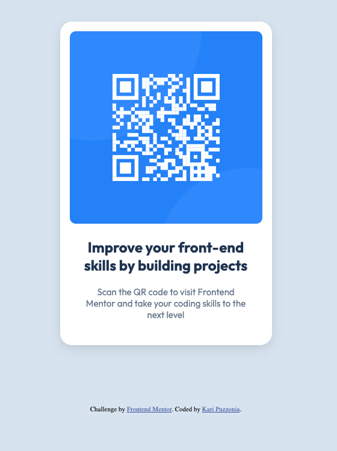

# Frontend Mentor - QR code component solution

This is a solution to the [QR code component challenge on Frontend Mentor](https://www.frontendmentor.io/challenges/qr-code-component-iux_sIO_H).

## Table of contents

- [Overview](#overview)
  - [Screenshot](#screenshot)
  - [Links](#links)
- [My process](#my-process)
  - [Built with](#built-with)
- [Author](#author)

## Overview

### Screenshot

### Links

- Solution URL: [https://github.com/kpuzzonia/qr-code-component](https://github.com/kpuzzonia/qr-code-component)
- Live Site URL: [https://kpuzzonia.github.io/qr-code-component/](https://kpuzzonia.github.io/qr-code-component/)

## My process

This project was a simple one to build. I was provided the QR picture and content by Frontend Mentor, along with an image of what the finished project should look like. 

My first step drawing a rough sketch of the different sections of the component. I then translated that iinto semantic HTML.

After making sure that the HTML was structured correctly, I applied styling. The font and color selections were provided to me. I played around until I was able to get the margins, padding, border-radius, etc. to my liking.

### Built with

- Semantic HTML5 markup
- CSS custom properties

## Author

- Website - [Kari Puzzonia](https://github.com/kpuzzonia)
- Frontend Mentor - [@kpuzzonia](https://www.frontendmentor.io/profile/kpuzzonia)
- Instagram - [@codewithkari](https://www.instagram.com/codewithkari/)
